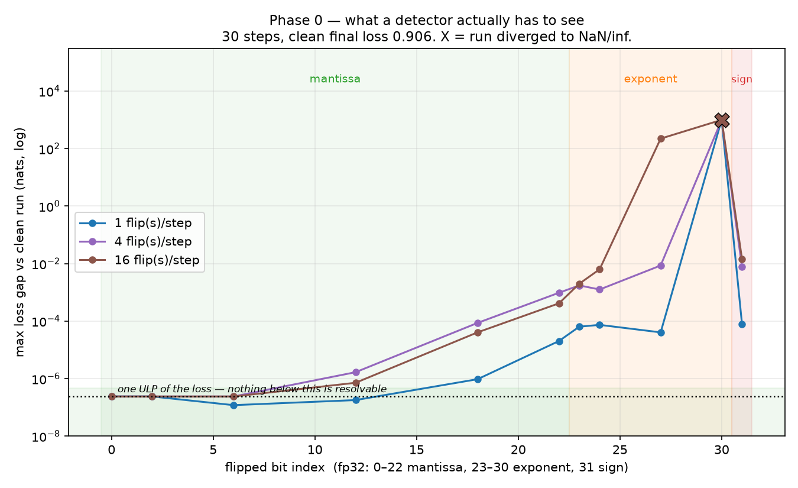

# sdc — Phase 0: a fault-injection harness

*Unrelated to the gravity inversion in the rest of this repository.* Parked here
because the session that wrote it could not create a new remote; imports nothing
from and is imported by nothing in `src/`. Extract with `git subtree split` when
it earns its own repo. Rationale and roadmap: [`../docs/compute-integrity-plan.md`](../docs/compute-integrity-plan.md).

## Why

Silent data corruption is far too rare to develop a detector against. Before any
detector exists, you need the ability to manufacture corruption on demand, at a
known rate, in a known place, at a known bit position — reproducibly. That is all
this is.

**Status: Phase 0 complete. 24/24 gates passing.** One prediction from the plan
was falsified by measurement; it is recorded below rather than quietly amended.

## Gates — declared before the code, reported either way

| Gate | Claim | Result |
|---|---|---|
| **0.1** | Same seed ⇒ bit-identical injection manifest | ✅ pass |
| **0.1b** | Same seed ⇒ bit-identical *weights* for an injected run | ✅ pass |
| **0.2** | Two clean runs at one seed ⇒ bit-identical weights | ✅ pass |
| **0.2b** | The loop actually learns (5.04 → 0.91 vs 4.85 unlearned) | ✅ pass |
| **0.3** | Exponent-MSB corruption is visible | ✅ pass — inf/NaN at every volume |
| **0.3-neg** | Low-mantissa corruption is *invisible*, yet lands | ✅ pass — at the loss ULP, fingerprint still differs |
| **0.3-sep** | Bit position separates the regimes by ≥100× | ✅ pass — ~1700× |

```
python -m pytest sdc/tests/ -q      # 24 passed in ~25s
python -m sdc.figures.difficulty    # regenerates the figure and JSON
```

## The result



Three things this says, and one of them is a correction.

**1. There is a genuinely invisible regime.** Flips in bits 0–12 move the loss by
2.384e-07 — exactly one ULP of the loss value itself — regardless of whether one
or sixteen elements are corrupted per step. The corruption is real (the weight
fingerprint changes) and the loss *cannot* resolve it, as a matter of floating
point, not of statistics. This is the regime Phase 1 exists for. Had it not
existed, any detector would have scored perfectly and meant nothing.

**2. Volume matters less than position.** Sixteen flips per step in low mantissa
bits stay at the floor. One flip in bit 30 destroys the run. A detector tuned on
corruption *volume* would be measuring the wrong axis.

**3. The plan was wrong about sign bits.** The difficulty table in the plan called
a sign flip "trivial" to detect. Measured: 16 sign flips per step move the loss by
~1e-2 and the run trains straight through. Sign corruption is loud in the tensor
and nearly silent in the loss — so the cheapest L0 signal, loss watching, would
miss it. Visible as the cliff between bit 30 and bit 31 in the figure.
`test_sign_flip_is_mild_not_catastrophic` pins this so it cannot quietly regress.

**Calibration disclosure.** The *structure* of Gate 0.3 (visible / invisible /
separated) was declared before the code existed. The numeric thresholds were set
after the sweep and are stated in `tests/test_divergence.py` rather than tuned
silently inside the assertions. They are measurements, not predictions.

## Design decisions that carry weight

**Separate RNG streams.** Model, data, and injector each draw from their own
`torch.Generator`. Sharing one would make an injected run diverge through
perturbed data ordering rather than through injection — invalidating every
comparison here while looking exactly like a result.
`test_injector_stream_is_independent_of_global_rng` guards it.

**Sampling without replacement.** `count=N` uses `randperm`. With replacement,
the same (index, bit) pair can be drawn twice in one call and two XORs cancel —
the manifest would record two corruptions with no net effect. Caught by a failing
gate, not by inspection. `randperm` is O(numel) per call and will need revisiting
before production-scale tensors.

**Straight-through corruption.** Activations are corrupted in the forward value
while the backward pass sees an identity — which is what a hardware fault does:
downstream consumes a wrong number and differentiates it as though it were right.

**Bit position is first-class.** Every event records its bit, and every result is
reported against that axis. A harness that only flips exponent bits makes any
detector look excellent and be worthless.

## Layout

```
inject.py          Injector, InjectionEvent — the seeded flip
model.py           TinyTransformer (~435k params), every Linear injection-capable
runner.py          Deterministic loop, clean/injected, identical code path
record.py          Telemetry + SHA-256 fingerprints (Gate 0.2 compares hashes,
                   not tolerances — a tolerance hides the drift being tested for)
tests/             The gates above
figures/           difficulty.py → difficulty.png + difficulty.json
```

Injection sites: `gemm_out`, `allreduce`, `optim_state`, `activation`.

## Environment

Adds **no new dependency** — `torch`, `numpy`, `matplotlib`, `pytest` are already
in the repo's `requirements.txt`, and the torch version resolved here (2.13.0)
matches the existing pin exactly.

Results above were produced on **python 3.11.15 / torch 2.13.0+cu130 (CPU) /
numpy 2.4.6 / pytest 9.1.1**, which is *not* the repo's pinned python 3.14.6 —
this container's environment differs from `requirements.txt`.

## What is not verified here

**No GPU was available in the environment that produced these results.** The
bit-flip arithmetic, RNG separation, and determinism gates are device-agnostic
and genuinely pass. These are *not* validated and are marked so in the code:

- `CUBLAS_WORKSPACE_CONFIG` — cuBLAS reads it at handle creation, typically
  before `set_determinism` runs. Export it in the shell instead:
  `CUBLAS_WORKSPACE_CONFIG=:4096:8 python -m pytest sdc/tests/`
- TF32 disabling and cuDNN determinism flags.
- Whether Gate 0.2 holds at all on CUDA. It may not, and that is
  [a declared kill condition](../docs/compute-integrity-plan.md) rather than a bug —
  if determinism is unachievable on real hardware, the replay layer of Phase 1
  dies and only statistical detection survives.

`torch.set_num_threads(1)` is required for Gate 0.2 on CPU; the container default
was 4, under which reduction order varies.

## Next

Phase 1 (L0 detectors) needs the invisible regime above as its target, and needs
its false-positive rate measured against the clean corpus this harness generates.
The bf16 repeat is open: bf16's mantissa LSB is ~2⁻⁷ ≈ 0.8% relative error rather
than fp32's 1.2e-7, so the invisible band should be far narrower — possibly absent.
Whether that makes detection easier or harder against noisier gradients is an
empirical question this harness can now answer.
