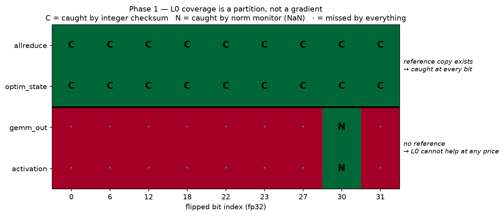
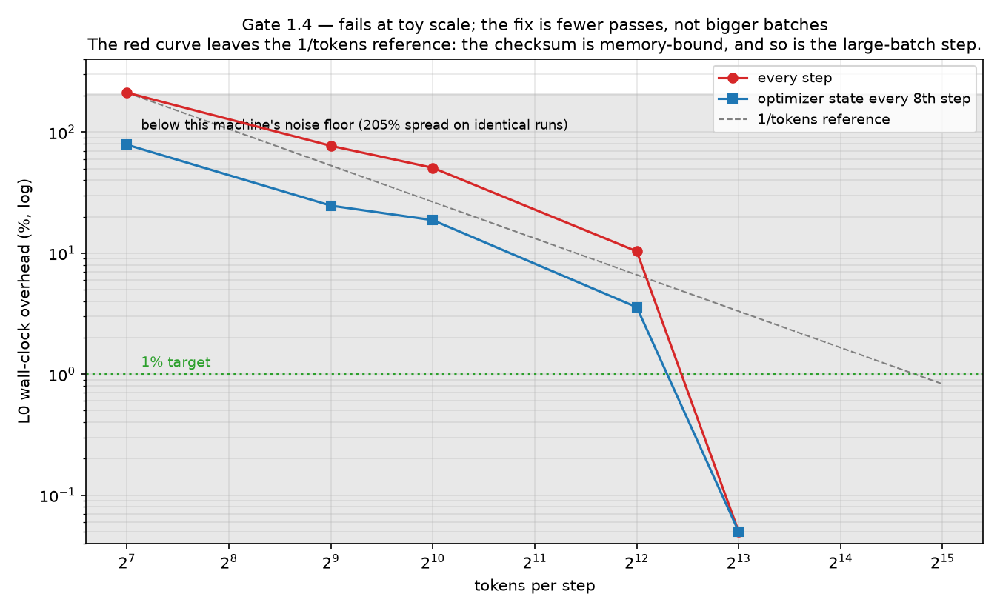

# sdc — fault injection (Phase 0) and L0 detection (Phase 1)

*Unrelated to the gravity inversion in the rest of this repository.* Parked here
because the session that wrote it could not create a new remote; imports nothing
from and is imported by nothing in `src/`. Extract with `git subtree split` when
it earns its own repo. Rationale and roadmap: [`../docs/compute-integrity-plan.md`](../docs/compute-integrity-plan.md).

## Why

Silent data corruption is far too rare to develop a detector against. Before any
detector exists, you need the ability to manufacture corruption on demand, at a
known rate, in a known place, at a known bit position — reproducibly. That is all
this is.

**Status: Phase 0 complete. 24/24 gates passing.** One prediction from the plan
was falsified by measurement; it is recorded below rather than quietly amended.

## Gates — declared before the code, reported either way

| Gate | Claim | Result |
|---|---|---|
| **0.1** | Same seed ⇒ bit-identical injection manifest | ✅ pass |
| **0.1b** | Same seed ⇒ bit-identical *weights* for an injected run | ✅ pass |
| **0.2** | Two clean runs at one seed ⇒ bit-identical weights | ✅ pass |
| **0.2b** | The loop actually learns (5.04 → 0.91 vs 4.85 unlearned) | ✅ pass |
| **0.3** | Exponent-MSB corruption is visible | ✅ pass — inf/NaN at every volume |
| **0.3-neg** | Low-mantissa corruption is *invisible*, yet lands | ✅ pass — at the loss ULP, fingerprint still differs |
| **0.3-sep** | Bit position separates the regimes by ≥100× | ✅ pass — ~1700× |

```
python -m pytest sdc/tests/ -q      # 24 passed in ~25s
python -m sdc.figures.difficulty    # regenerates the figure and JSON
```

## The result


Three things this says, and one of them is a correction.

**1. There is a genuinely invisible regime.** Flips in bits 0–12 move the loss by
2.384e-07 — exactly one ULP of the loss value itself — regardless of whether one
or sixteen elements are corrupted per step. The corruption is real (the weight
fingerprint changes) and the loss *cannot* resolve it, as a matter of floating
point, not of statistics. This is the regime Phase 1 exists for. Had it not
existed, any detector would have scored perfectly and meant nothing.

**2. Volume matters less than position.** Sixteen flips per step in low mantissa
bits stay at the floor. One flip in bit 30 destroys the run. A detector tuned on
corruption *volume* would be measuring the wrong axis.

**3. The plan was wrong about sign bits.** The difficulty table in the plan called
a sign flip "trivial" to detect. Measured: 16 sign flips per step move the loss by
~1e-2 and the run trains straight through. Sign corruption is loud in the tensor
and nearly silent in the loss — so the cheapest L0 signal, loss watching, would
miss it. Visible as the cliff between bit 30 and bit 31 in the figure.
`test_sign_flip_is_mild_not_catastrophic` pins this so it cannot quietly regress.

**Calibration disclosure.** The *structure* of Gate 0.3 (visible / invisible /
separated) was declared before the code existed. The numeric thresholds were set
after the sweep and are stated in `tests/test_divergence.py` rather than tuned
silently inside the assertions. They are measurements, not predictions.

## Design decisions that carry weight

**Separate RNG streams.** Model, data, and injector each draw from their own
`torch.Generator`. Sharing one would make an injected run diverge through
perturbed data ordering rather than through injection — invalidating every
comparison here while looking exactly like a result.
`test_injector_stream_is_independent_of_global_rng` guards it.

**Sampling without replacement.** `count=N` uses `randperm`. With replacement,
the same (index, bit) pair can be drawn twice in one call and two XORs cancel —
the manifest would record two corruptions with no net effect. Caught by a failing
gate, not by inspection. `randperm` is O(numel) per call and will need revisiting
before production-scale tensors.

**Straight-through corruption.** Activations are corrupted in the forward value
while the backward pass sees an identity — which is what a hardware fault does:
downstream consumes a wrong number and differentiates it as though it were right.

**Bit position is first-class.** Every event records its bit, and every result is
reported against that axis. A harness that only flips exponent bits makes any
detector look excellent and be worthless.

## Layout

```
inject.py          Injector, InjectionEvent — the seeded flip
model.py           TinyTransformer (~435k params), every Linear injection-capable
runner.py          Deterministic loop, clean/injected, identical code path
record.py          Telemetry + SHA-256 fingerprints (Gate 0.2 compares hashes,
                   not tolerances — a tolerance hides the drift being tested for)
tests/             The gates above
figures/           difficulty.py → difficulty.png + difficulty.json
```

Injection sites: `gemm_out`, `allreduce`, `optim_state`, `activation`.

## Environment

Adds **no new dependency** — `torch`, `numpy`, `matplotlib`, `pytest` are already
in the repo's `requirements.txt`, and the torch version resolved here (2.13.0)
matches the existing pin exactly.

Results above were produced on **python 3.11.15 / torch 2.13.0+cu130 (CPU) /
numpy 2.4.6 / pytest 9.1.1**, which is *not* the repo's pinned python 3.14.6 —
this container's environment differs from `requirements.txt`.

## What is not verified here

**No GPU was available in the environment that produced these results.** The
bit-flip arithmetic, RNG separation, and determinism gates are device-agnostic
and genuinely pass. These are *not* validated and are marked so in the code:

- `CUBLAS_WORKSPACE_CONFIG` — cuBLAS reads it at handle creation, typically
  before `set_determinism` runs. Export it in the shell instead:
  `CUBLAS_WORKSPACE_CONFIG=:4096:8 python -m pytest sdc/tests/`
- TF32 disabling and cuDNN determinism flags.
- Whether Gate 0.2 holds at all on CUDA. It may not, and that is
  [a declared kill condition](../docs/compute-integrity-plan.md) rather than a bug —
  if determinism is unachievable on real hardware, the replay layer of Phase 1
  dies and only statistical detection survives.

`torch.set_num_threads(1)` is required for Gate 0.2 on CPU; the container default
was 4, under which reduction order varies.

---

# Phase 1 — L0 detectors

**Status: built, 61/61 gates passing.** One gate is *unmeasurable on this
hardware* rather than passed or failed, and is reported that way below.

## What Phase 0 forced to change

The plan's L0 was built around loss and gradient-norm watching. Phase 0 falsified
that: the loss cannot resolve low-mantissa corruption **at all**, because the gap
sits at one ULP of the loss value. That is a representation floor, not a
statistical one, and no threshold recovers a signal below the resolution of the
quantity being thresholded. Loss watching was demoted to a weak corroborator and
the load moved onto checksums.

## The design point: the checksum lives in the integer domain

A float sum fails for exactly the reason the loss fails — floating-point addition
is lossy, and a mantissa-LSB flip moves the sum by less than the sum's own ULP.
Reinterpret the same bits as integers and that flip becomes a change of exactly
±2ᵏ, which no accumulator can round away. Detection becomes **exact rather than
statistical, at the same cost.** A test demonstrates the float version missing a
flip the integer version catches, rather than asserting it.

Two accumulators, both O(n) and vectorised:

- **plain modular sum** — catches any single flip.
- **index-weighted modular sum** — closes the plain sum's blind spot, where two
  flips of the same bit index (one 0→1, one 1→0) contribute +2ᵏ and −2ᵏ and cancel
  exactly. Weights are `(i mod P) + 1`, never 0, or a flip at index 0 would be
  invisible to the weighted accumulator.

## The result: coverage is a partition, not a gradient



| Site | Reference copy? | Caught by | Cost |
|---|---|---|---|
| `allreduce` | yes — before/after transport | checksum, **every bit** | 2 passes |
| `optim_state` | yes — across write/read | checksum, **every bit** | 4 passes |
| `gemm_out` | **no** | nothing subtle; NaN only | — |
| `activation` | **no** | nothing subtle; NaN only | — |

The bottom half is **structural, not a shortfall**. A GEMM output is the only copy
of itself; there is no uncorrupted reference to compare against, so this layer
cannot catch corruption there at any price. That is the entire argument for L1 and
L2 existing, and two gates pin it deliberately — `test_checksum_cannot_see_
unreferenced_sites` and `test_subtle_arithmetic_is_caught_by_nothing`. If the
latter ever starts passing, L0 got stronger and the plan's cost model needs
revisiting.

## Gates

| Gate | Claim | Result |
|---|---|---|
| **1.1** | Checksum catches 100% at referenced sites, **every bit incl. 0** | ✅ pass |
| **1.2** | Same-bit-index pair still caught (plain sum alone fails) | ✅ pass |
| **1.3** | Zero false positives across 8 clean seeds | ✅ pass, K disclosed |
| **1.4** | Wall-clock overhead <1% | ⚠️ **unmeasurable here** — see below |
| **1.5** | Honest failure at unreferenced sites | ✅ pass *by documenting it* |

## Gate 1.4 — reported as unmeasurable, not as a number



The wall-clock arm of this gate **cannot be evaluated on this container.**
Repeating the *same unguarded configuration* and measuring its spread gave a noise
floor of 4.9%, then 58.7%, then 205% on three separate attempts. Several A/B
measurements returned negative overhead, which is impossible and therefore
diagnostic. The instrument is less stable than the effect being measured, so no
wall-clock number here is reportable.

What *is* trustworthy is the analytic model, which is deterministic and does not
depend on machine load:

| optim stride | passes over params/step | detector:step bytes | detector:step FLOPs |
|---|---|---|---|
| 1 | 6.00 | 405% | 0.391% |
| 8 | 2.50 | 169% | 0.163% |
| 32 | 2.12 | 143% | 0.138% |

Four of the six passes are optimizer state (two moments, stamped and verified), so
striding those to every Nth step is the dominant lever — `Guards(optim_stride=8)`
cuts 6 passes to 2.5. The floor is 2: gradients are stamped and verified every
step and cannot be strided, because a gradient exists for one step only and a
missed check is a permanently missed corruption. **Striding trades coverage for
cost and the trade is real** — optimizer corruption between checked steps is
missed outright.

The honest reading: against step *FLOPs* the layer is already well under 1%, but
it is memory-heavy against a model this small. Whether it lands under 1% in
practice depends on whether the real step is compute-bound or memory-bound, which
is a GPU question this container cannot answer. **Gate 1.4 is deferred to hardware,
not claimed.**

## A bug the sweep caught that review did not

`NormMonitor` silently ignored non-finite values. Every comparison against NaN is
False, so a z-score test skipped the single loudest signal available — a NaN
gradient norm produced no alarm at all. Found by noticing that catastrophic
`gemm_out` corruption showed `norm=False` in the coverage sweep. Fixed, with a
regression gate.

## Next

**Phase 2 — localization.** Detection without "which device" is not actionable.
The checksum already knows *which tensor* failed; mapping that to a device needs
the simulated topology.

**bf16, still open and cheap.** bf16's mantissa LSB is ~2⁻⁷ ≈ 0.8% relative error
against fp32's 1.2e-7, so the invisible band should be far narrower or absent.
Since real training is bf16, this decides whether the invisible regime is a
production concern or an fp32 artifact — load-bearing for the pitch, and answerable
by changing one dtype.

**On GPU, in order:** does Gate 0.2 (clean determinism) survive CUDA at all — the
declared kill condition — then Gate 1.4 on a quiet machine.
